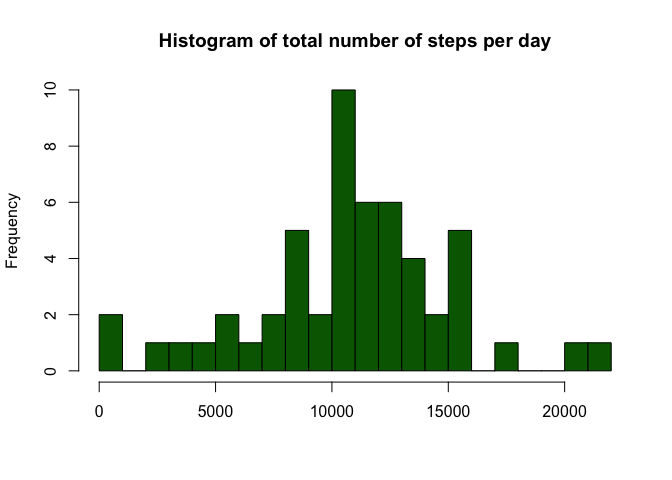
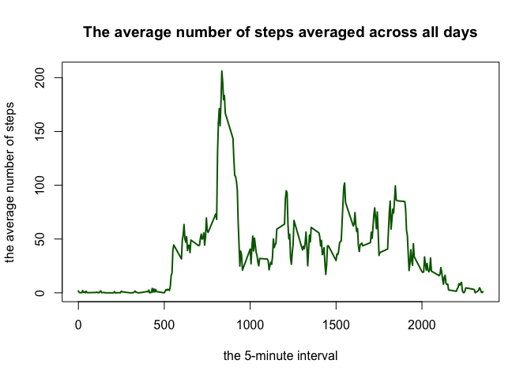
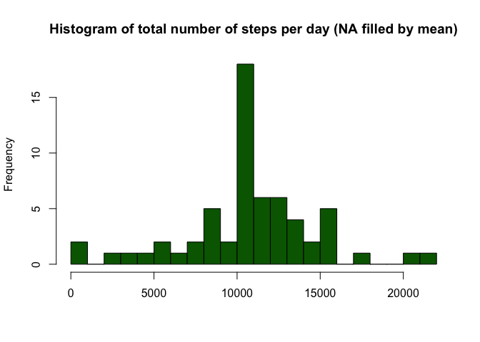
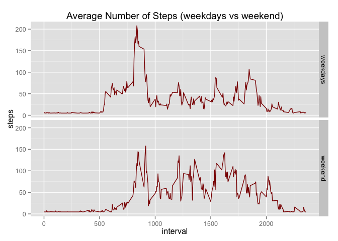

# Reproducible Research: Peer Assessment 1


## Loading and preprocessing the data

```r
# load packages used in this exploratory analysis
library(knitr)
library(dplyr)
```

```
## 
## Attaching package: 'dplyr'
## 
## The following objects are masked from 'package:stats':
## 
##     filter, lag
## 
## The following objects are masked from 'package:base':
## 
##     intersect, setdiff, setequal, union
```

```r
library(ggplot2)
```

```r
DATAactivity <- read.csv("activity.csv", header = TRUE, sep = ",")
str(DATAactivity)
```

```
## 'data.frame':	17568 obs. of  3 variables:
##  $ steps   : int  NA NA NA NA NA NA NA NA NA NA ...
##  $ date    : Factor w/ 61 levels "2012-10-01","2012-10-02",..: 1 1 1 1 1 1 1 1 1 1 ...
##  $ interval: int  0 5 10 15 20 25 30 35 40 45 ...
```

```r
summary(DATAactivity)
```

```
##      steps                date          interval     
##  Min.   :  0.00   2012-10-01:  288   Min.   :   0.0  
##  1st Qu.:  0.00   2012-10-02:  288   1st Qu.: 588.8  
##  Median :  0.00   2012-10-03:  288   Median :1177.5  
##  Mean   : 37.38   2012-10-04:  288   Mean   :1177.5  
##  3rd Qu.: 12.00   2012-10-05:  288   3rd Qu.:1766.2  
##  Max.   :806.00   2012-10-06:  288   Max.   :2355.0  
##  NA's   :2304     (Other)   :15840
```
There are 2304 NA's value.

## What is mean total number of steps taken per day?

```r
# generate DATAactivity1 without NA
DATAactivity1 <- na.omit(DATAactivity)

#aggregate total number of steps in a day
DATA_date_steps <- aggregate(steps ~ date, DATAactivity1, sum)

#Make a histogram of the total number of steps taken each day
hist(DATA_date_steps$steps, col="dark green", breaks = 30,
     main="Histogram of total number of steps per day", xlab = "")
```

 

```r
#Calculate and report the mean and median of the total number of steps taken per day
mean(DATA_date_steps$steps)          
```

```
## [1] 10766.19
```

```r
median(DATA_date_steps$steps)        
```

```
## [1] 10765
```

## What is the average daily activity pattern?

```r
DATA_interval_steps <- aggregate(steps ~ interval, DATAactivity1, mean)
```
####Make a time series plot(i.e. type = "l") of the 5-minute interval (x-axis) and the average number of steps taken, averaged across all days (y-axis).

```r
plot(DATA_interval_steps$interval, DATA_interval_steps$steps, type = "l", lwd = 2, col = "dark green",
     main = "The average number of steps averaged across all days",
     xlab = "the 5-minute interval",
     ylab = "the average number of steps")
```

 

####Which 5-minute interval, on average across all the days in the dataset, contains the maximum number of steps?

```r
#find row with max value of steps
max_steps_row <- which.max(DATA_interval_steps$steps)

#find interval with this max value
DATA_interval_steps[max_steps_row, ]
```

```
##     interval    steps
## 104      835 206.1698
```

## Imputing missing values
####Calculate and report the total number of missing values in the dataset

```r
sum(is.na(DATAactivity)) 
```

```
## [1] 2304
```
####Create a new dataset that is equal to the original dataset but with the missing data filled in

```r
DATA <- DATAactivity
DATA$steps[is.na(DATA$steps)] <- mean(DATA$steps, na.rm = TRUE)
colSums(is.na(DATA))        
```

```
##    steps     date interval 
##        0        0        0
```
####Make a histogram of the total number of steps taken each day

```r
DATA_day_steps <- aggregate(steps ~ date, DATA, sum)

hist(DATA_day_steps$steps, col = "dark green", breaks = 30,
     main="Histogram of total number of steps per day (NA filled by mean)", xlab = "")
```

 

####Calculate and report the mean and median total number of steps taken per day

```r
mean(DATA_day_steps$steps) 
```

```
## [1] 10766.19
```

```r
median(DATA_day_steps$steps) 
```

```
## [1] 10766.19
```
___After imputing missing value with mean value of steps -> Mean = Median___

## Are there differences in activity patterns between weekdays and weekends?
####Create a new factor variable in the dataset with two levels - "weekday" and "weekend" indicating whether a given date is a weekday or weekend day.

```r
DATA$date <- as.Date(DATA$date)
DATA$weekdays <- weekdays(DATA$date)
head(DATA)
```

```
##     steps       date interval weekdays
## 1 37.3826 2012-10-01        0   Monday
## 2 37.3826 2012-10-01        5   Monday
## 3 37.3826 2012-10-01       10   Monday
## 4 37.3826 2012-10-01       15   Monday
## 5 37.3826 2012-10-01       20   Monday
## 6 37.3826 2012-10-01       25   Monday
```

```r
DATA$weeks[(DATA$weekdays == "Saturday" | DATA$weekdays == "Sunday")] <- "weekend"
DATA$weeks[!(DATA$weekdays == "Saturday" | DATA$weekdays == "Sunday")] <- "weekdays"

DATAweeks <- aggregate(steps ~ interval+weeks, DATA, mean)
```
####Make a panel plot containing a time series plot (i.e. type = "l") of the 5-minute interval (x-axis) and the average number of steps taken, averaged across all weekday days or weekend days (y-axis).

```r
head(DATAweeks)
```

```
##   interval    weeks    steps
## 1        0 weekdays 7.006569
## 2        5 weekdays 5.384347
## 3       10 weekdays 5.139902
## 4       15 weekdays 5.162124
## 5       20 weekdays 5.073235
## 6       25 weekdays 6.295458
```

```r
tail(DATAweeks)
```

```
##     interval   weeks     steps
## 571     2330 weekend  5.735325
## 572     2335 weekend 15.672825
## 573     2340 weekend 10.547825
## 574     2345 weekend  6.297825
## 575     2350 weekend  4.672825
## 576     2355 weekend  4.672825
```


```r
ggplot(DATAweeks, aes(interval, steps)) +
        facet_grid(weeks ~ .) + geom_line(color="dark red") +
        ggtitle("Average Number of Steps (weekdays vs weekend)")
```

 

___On weekdays, we can see a lot of movement at 8.35 am. During the weekend motion more evenly throughout the day.___
